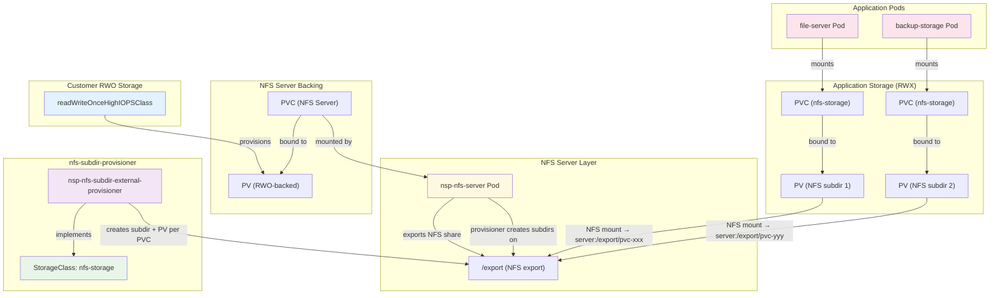

```mermaid
flowchart TB
    subgraph CustomerRWO["Customer RWO Storage"]
        SC_RWO["readWriteOnceHighIOPSClass"]
    end

    subgraph NFSBacking["NFS Server Backing"]
        PVC_NFS["PVC (NFS Server)"]
        PV_NFS["PV (RWO-backed)"]
        SC_RWO -->|provisions| PV_NFS
        PVC_NFS -->|bound to| PV_NFS
    end

    subgraph NFSServerLayer["NFS Server Layer"]
        NFS_SERVER["nsp-nfs-server Pod"]
        PVC_NFS -->|mounted by| NFS_SERVER
        NFS_SERVER -->|exports NFS share| NFS_EXPORT["/export (NFS export)"]
    end

    subgraph Provisioning["nfs-subdir-provisioner"]
        PROV["nsp-nfs-subdir-external-provisioner"]
        SC_NFS["StorageClass: nfs-storage"]
        PROV -->|implements| SC_NFS
        NFS_SERVER -->|provisioner creates subdirs on| NFS_EXPORT
        PROV -->|creates subdir + PV per PVC| NFS_EXPORT
    end

    subgraph AppStorage["Application Storage (RWX)"]
        PVC1["PVC (nfs-storage)"]
        PVC2["PVC (nfs-storage)"]
        PV1["PV (NFS subdir 1)"]
        PV2["PV (NFS subdir 2)"]
        PVC1 -->|bound to| PV1
        PVC2 -->|bound to| PV2
        PV1 -->|NFS mount → server:/export/pvc-xxx| NFS_EXPORT
        PV2 -->|NFS mount → server:/export/pvc-yyy| NFS_EXPORT
    end

    subgraph AppPods["Application Pods"]
        FILE_SERVER["file-server Pod"]
        BACKUP["backup-storage Pod"]
        FILE_SERVER -->|mounts| PVC1
        BACKUP -->|mounts| PVC2
    end

    style SC_RWO fill:#e3f2fd
    style NFS_SERVER fill:#fff8e1
    style PROV fill:#f3e5f5
    style SC_NFS fill:#e8f5e9
    style FILE_SERVER fill:#fce4ec
    style BACKUP fill:#fce4ec
```
